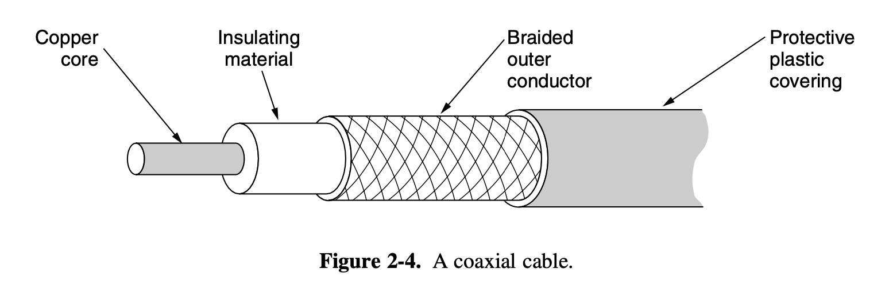
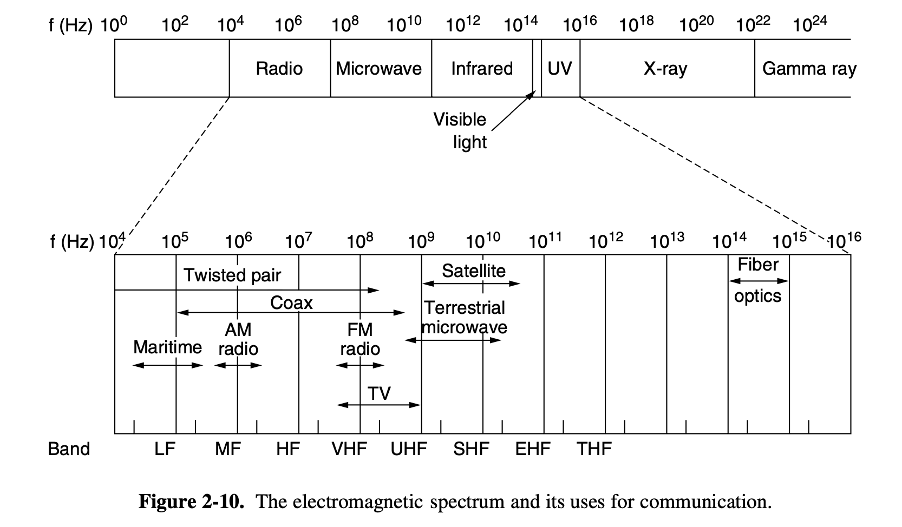
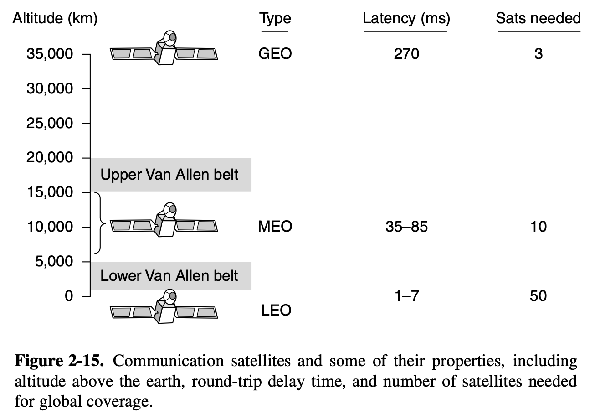

# Physical Layer

This section is the majority of midterm 1 I think, just note most of the math
concepts in this chapter i.e. Data Rate both Shannon and Nyquist, and the
wavelength formula $\lambda{} = \frac{c}{f}$

## 2.1 Theoretical Basis for Communication

This is where all the math is and all that important stuff

### 2.1.1 Fourier Analysis

Super cool and important formulas giving the coefficients:
$$
a_n = \frac{2}{T}\int^{T}_{0}g(t)sin(2\pi{}nft)dt \qquad b_n = \frac{2}{T}\int^{T}_{0}g(t)cos(2\pi{}nft)dt \qquad c = \frac{2}{T}\int^{T}_{0}g(t)dt
$$

### 2.1.2 Bandwidth Limited Signals

Definitions:

- **Bandwidth** the width of the frequency range transmitted without being strongly attenuated
- **Baseband** signals which run from 0 to max
- **Passband** signals shifted to occupy higher frequencies used in all wireless transmission

### 2.1.3 Maximum Data Rate of a Channel

Nyquist shows that a perfect channel has a finite capacity (maximum data rate)
given by the equation:
$$
2Blog_2(V)
$$
where $V$ is the discrete levels of the channel, and $B$ is the bandwidth

If a channel is noisy Shannon showed that a noisy channel has a maximum data rate given by the following equation:
$$
Blog_2(1 + SNR)
$$
where $SNR$ is the signal to noise ratio given in $dB$ a ratio of 1000 is 30$dB$
i.e. we can calculate this from a $SNR$ to $dB$ via $10log_{10}(x) = y$ where
$y$ is the value in $dB$ and $x$ is the signal to noise ratio.

## 2.2 Guided Transmission Media

The goal of the physical layer is to move bits from one machine to another.

### 2.2.1 Magnetic Media

In this section it seems quite useless but here we realize something important
say you have a 1 TB hard drive and you pass it to the guy next to you this takes
approximately 1 sec in order to transmit the same data over network at 100 MBps
it would take significantly longer in some cases, physically moving some data is
faster than waiting on modern transmission methodologies specifically for large
amounts of data.

### 2.2.2 Twisted Pairs

Definitions:

- **Twisted Pair** consists of 2 copper wires approx 1 mm thick the wires are twisted around each other to produce an antenna the waves from different twists cancel out meaning it radiates less effectively this makes it more resistant to external noise.
- **Category 5** Cat 5 cables are commonly used and made up of 4 twisted pairs
- **Full Duplex** Links that can be used at the same time both ways
- **Half Duplex** Links that can only be used 1 way at a time
- **Simplex** Links only allow traffic in 1 direction

### 2.2.3 Coaxial Cable

This is fairly irrelevant here's a picture:

### 2.2.4 Power Lines

Irrelevant

### 2.2.5 Fiber Optics

Some Advantages of Fiber Optics are as follow:

- High bandwidth
- Low attenuation (Fewer repeaters needed than for copper)
- Resistant to interference and chemicals*
- Thin and lightweight
- Wiretapping is Difficult (Better Security)

Some Disadvantages of Fiber Optics are as follows:

- Needs special expertise
- Damaged by bending
- Interfaces are costly

## 2.3 Wireless Transmission

Big idea here is $\lambda{}f = c$ we can derive a bunch of things from this in
this section. Another thing is higher frequency = more data

### 2.3.1 Electromagnetic Spectrum

Diagram of E&M spectrum which gives us where various data transmission
technologies discussed previously fall:

Definitions:

- **Direct Sequence Spread Spectrum** uses a code signal to spread the data signal over a wider frequency band
- **CDMA (Code Division Multiple Access)** frequencies can be given different codes using this method
- **UWB (Ultra Wide Band)** A series of frequency pluses are spread thinly across a larger frequency band

## 2.4 Satellite Communication

## 2.5 Digital Modulation and Multiplexing

#### Digital Modulation

Definitions

So let's start off with an exercise to say what's an important thing to keep in
mind from this section: Five channels each with 100 KHz bandwidth need a guard
band of 10 KHz to prevent interference what's the minimum bandwidth of the link
required for this setup?

The answer is: $100 \times{} 5 + 10 \times{} 4 = 540$ KHz

#### Multiplexing Exercise
