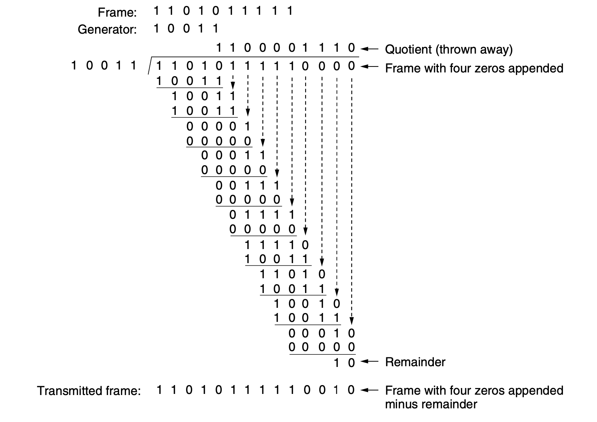

# Data Link

## 3.1 Data Link Layer Design Issues

The data link layer uses the physical layer to send / receive bits over communication channels. The data layer does the following:

- Provides a well defined interface to the network layer
- Deals with transmission errors
- Regulating the flow of data so that slow receivers are not swamped by fast senders

## 3.2 Error Detection and Correction

The usage of error correcting codes is often referred to as **FEC (Forward Error Correction)** 

### 3.2.1 Error Correcting Codes

There are a few error correcting codes

- Hamming Codes
- Binary Convolution Codes
- Reed Solomon Codes
- Low Density Parity Check Codes

All codes add redundancy to the information sent

### 3.2.2 Error Detecting Codes

Error detecting codes are typically used more often on wireless links as they are notoriously noisy and error prone error detecting codes include:

- Parity
- Check Sum
- CRCs (Cyclic Redundancy Check)

To see how detecting codes may be more efficent we can look at something like
parity which is only a single bit which lets us know if the number of bits is
odd or even thus it only takes 1 bit of information to let us know if there's
bit a flip to a single bit of information (note how this works for +1 bit but
not +n bits)

CRC works as follows [1]

- Let $r$ be the degree of the generator polynomial $G(r)$ append $r$ zero bits to the low-order end of the frame so it now contains $m + r$ bits corresponds to the polynomial $x^rM(x)$
- Divide the bit string corresponding to $G(x)$ into bit string corresponding to $x^rM(x)$ using modulo 2 division
- Subtract the remainder from the bit string corresponding to $x^rM(x)$ using modulo 2 subtraction the result is checksumed to the frame transmitted call it's polynomial $T(x)$

## 3.3 Elementary Data Link Protocols

## What is He Talking About?

Derive a relationship between some quantities: 

T = senter time out, F = frame size, C = channel rate, P = propagation delay, R
= processing time, $T_p$ = piggyback timeout

cooked
$\frac{F}{C} + P + R + T_p + \frac{F}{C} + P < T$

Brother is talking about selective repeat and NACK what is that? We're in 3.4
I'm so far behind man :(

## Works Cited

[1] - *Computer Networks*, 5th ed., Tanenbaum et. al., Pearson, 2011

## Slides Notes

The data link layer's main purpose is to communicate with adjacent machines
the data link layer faces several issues including

- Providing service to the network layer
- Framing
- Error control
- Flow control

The network layer creates packets which travel as payloads to the data layers
frames generates a virtual pipe between data layers i.e. seems that things can
be abstracted up to that level even if the data is actually traveling the full
way

### Data Layer and It's Jobs

The data layer provides service to the network layer

There are 3 possible service classes:

- Unacknowledged conectionless service
- Acknowledged conectionless service
- Acknowledged connection oriented service

The services break down as follows:

**Unacknowledged Connectionless Service** the source sends independent frames to
the destination, and the destination does not acknowledge them, additionally no
logical connection is established, the frame is then lost and no attempt is made
to recover it. This is valid for low error rate lines, and delay sensitive
traffic typically used by LANs because they carry low error rate lines with
delay sensitive data.

**Acknowledged Conectionless Service** independent frames are sent but each is
acknowledged sometimes called ACK, if no ACK is received the sender will resend
the packet this provides us with *some* reliability but still no logical
connection will be setup this is good for unreliable channels and are typically
used with wireless networks.

**Acknowledged Connection Oriented Service** the source and destination will
establish a connection before any data is sent and each frame sent over the
connection is numbered. Additionally, each frame sent over the connection is
guaranteed exactly once and in the correct order, this is a reliable bit stream

### Main Issues at the Data Link Layer

One of the issues we run into at the data layer is with framing. Packets from
the network layer are encapsulated into frames, the reason this is done is for
error localization, in the case of an error only a single frame may need to be
repeated instead of the entire packet. The data layer mostly deals in frame
management, each frame contains: header, payload and a trailer.

### Framing

The issue of framing is fundamentally marking the start and end of a frame there
are 4 methods discussed: 1 byte count, 2 flag bytes with stuffing, 3 starting
and ending flags with bit stuffing and 4 PHY encoding (physical encoding).

**Byte Count** uses a field in the header to specify the number of bytes in a
*frame, the problem with this is that the counter field can get messed up by a
*transmission error even if the checksum fails there's no way to locate the
*start of the next frame this method isn't really used anymore.

**Flag Bytes with Byte Stuffing** frames will start and end on a specific byte
called the FLAG byte. If the sync is lost a receiver can just look for the next
FLAG byte, the issue here is binary data may just have the FLAG byte occur in
the data. The solution to this issue is called byte stuffing where we insert an
ESC byte before the FLAG if there's an ESC byte in the data we just add another
ESC byte before that ESC byte so in general the byte stuffing algorithm works by
inserting an ESC byte before every original occurrence of FLAG and ESC bytes.

**Starting and Ending Flags with Bit Stuffing** the problem with FLAG bytes is
they only consider 8 bits which is not universal. Bit flags each frame will
start and end with FLAG byte we can encode this into bits, in order to avoid
FLAG inside of the frame we stuff bits, such that no 6 1s may occur so a 0 is
stuffed after every consecutive 5 1 bits the receiver will then delete the 0s

**Physical Encoding** applicable when encoding on the physical medium and
contains some redundancy for example oftentimes a single bit may represent 2
"physical bits" commonly used *manchester encoding* every bit has a transition
in the middle making it easier to find bit boundaries high-high and low-low may
be used for framing, what this means is for example we may represent 1 as 10 or
0 as 01 in the case we see something like 00 or 11 can use these for framing the
trade off here is that it costs twice the bandwidth.

### Error Control

The nature of errors, either errors are isolated, or bursty, bursty meaning they
come in bursts of bits close to each other isolated errors are usually isolated
to a single bit.

There are two strategies for dealing with errors: 1 error correcting codes and 2
error detecting codes. Error correcting codes contain enough redundant info for
a receiver to determine what was supposed to be sent this is good for noisy
channels such as wireless. Error detecting codes just detect the error and allow
us to know when to request a retransmission this is good for low error rate
channels such as fiber optic.

### Error Correcting Codes

There are a number of error correcting codes also known as forward error
correction (FEC) these include: hamming codes, binary convolution codes, reed
solomon codes, low density parity check codes.

**Codeword** an n-bit unit with data and check bits $m + r = n$ where $m$ is the
message bits and $r$ is the redundancy bits this gives us $n$ the total number
of bits

**Hamming Codes** there may be a list of words that may be generated be a
message $2^m$ this is less than $2^n$ as $m + r = n$ hence the valid codewords
are a subset of all possible transmissions. In order to correct $d$ single bit
errors we need a code with at least $H = 2d + 1$ distance this is because then
the closest legal codeword is the original codeword we want to find to detect
$d$ errors we only need $H = d + 1$ distance.

How many check bits are required to resolve single errors? $2^m(n+1) \leq{} 2^n$
simplifying we obtain $m + r + 1 \leq{} 2^r$ from this given m we may solve for
$r$ do note this solution is known as hamming code this is optimal as it is the
minimal number of check bits but only corrects single errors.

**Constructing Hamming Codes** there's a strightforward algorithm for
constructing hamming codes: determine the number of check bits using the
previous formula i.e. $m + r + 1 \leq{} 2^r$, assign bit positions (1, 2, 4, 6,
8, ...), place data bits, and finally calculate the parity for each check bit.

### Data Link Protocols

