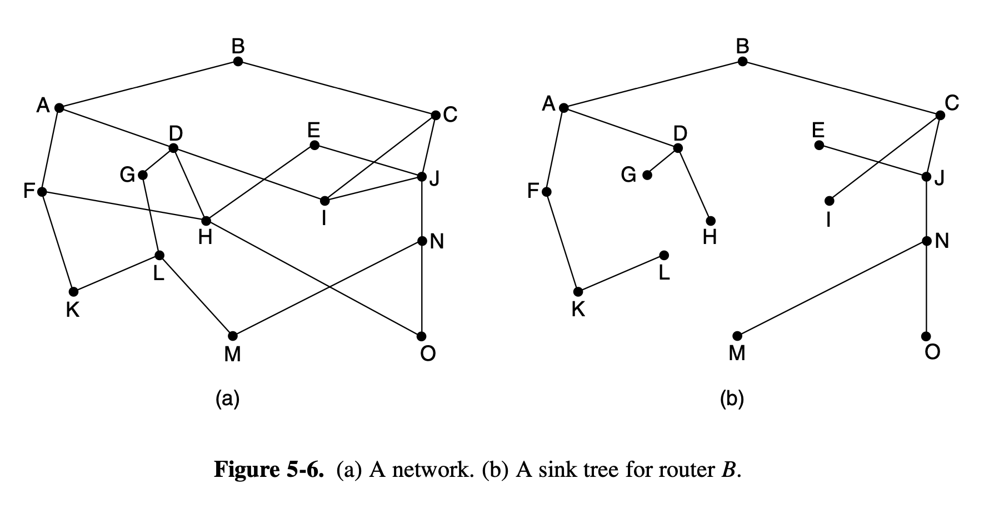
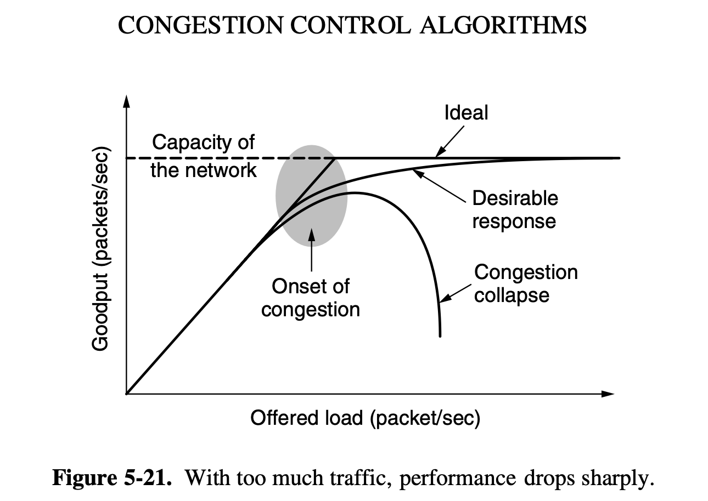
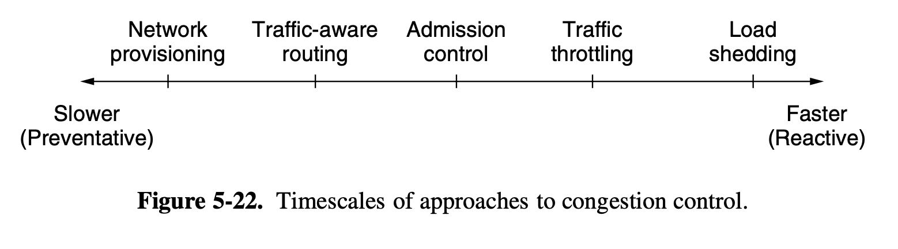

# Network Layer

## 5.1 Network Layer Design Issues

### 5.1.1 Store and Forward Packet Switching

This section is essentially saying we're mostly concerned with the algorithms
not really care what is running them, store and forward is discussed in previous
chapter.

### 5.1.2 Services Provided to Transport Layer

The network layer provides services to the transport layer services must be designed with the following in mind:

1. Services should be independent of router technology
2. The transport layer should be shielded from number type and topology of routers present
3. The network addresses made available to the transport layer should use uniform numbering plan even across LANs and WANs

### 5.1.3 Implementation of Connectionless Service

In a connectionless service we have a datagaram network where datagrams
(telegrams with data) are sent across the network as per a connectionless
service. In a connected service we use virtual circuits (VC) where a connection
is establish for a datagram across a VC before we send the datagram

### 5.1.4 Implementation of Connection Oriented Service

For a connection oriented service we use VC network. We establish a virtual
circuit across the network from the `src` to `dest` each node stores something
in their tables and this virtual circuit is used until the connection is closed
then the virtual circuit is closed.

**TODO** finish this section there's a diagram explaining the tables and
explanation

#### 5.1.5 Comparison of VC and Datagram Networks

| **Issue** | **Datagram Network** | **Virtual-circuit Network** |
|---|---|---|
| Circuit Setup | Not needed | Required |
| Addressing | Each packet contains source and destination addresses | Each packet contains a short VC number |
| State Information | Routers do not hold state info about connections | Each VC requires router table space for each connection |
| Routing | Each packet is routed independently | Established path |
| Effect of router failures | None, except for lost packets | All VCs which pass through are broken and router is terminated |
| Quality of Service | Difficult | Easy if enough resources can be allocated |
| Congestion Control | Difficult | Easy if enough resources can be allocated |

## 5.2 Routing Algorithms

The main purpose of this layer is the problem of routing. Routing packets from
source to destination.

**forwarding** happens when a packet arrives we look up information about the
outgoing connection in the routing table as to where to send the packet and
**routing** fills and updates routing tables.

this feels like there's a lot of explanation going on but not a lot of rigorous
things that can be tested on

### Routing Overview (Slides)

- Link State Routing
- Hierarchical Routing
- Broadcast Routing
    - Spanning Tree
    - Reverse Path Forwarding

### 5.2.1 The Optimality Principle

The optimality principle states that if the shortest path between `I` and `K`
has some router `J` then the shortest path between `J` and `K` falls along the
same path

The set of optimal routes from all sources to a given destination constructs a
**sink tree** which is rooted at `dest` where the metric is the number of hops

If all possible paths are chosen it constructs a **DAG**

### 5.2.2 Shortest Path Algorithm

TODO

## 5.3 Congestion Control Algorithms

When too many packets are present in the system such that the performance begins
to degrade we call this **congestion**.

This graph shows how congestion happens there's a carrying capacity of a network
and once more packets are being sent than carrying capacity the packets/seconds
begins to degrade and the offered packets passes up the carrying capacity of the
network:

It's possible sometimes that you run into a **congestion collapse** where the
performance of the network collapses under excessive load.

### 5.3.1 Approaches to Congestion Control

Two solutions arise for congestion, either increase the resources or decrease
the load different solutions are usually applied on different time scales to
either prevent the congestion or react to congestion as it occurs.

**provisioning** is when we create more resources this usually takes a while and
is reactive over large timescales to consistently high traffic. 
**Traffic-aware routing** is like when we have a helicopter which reports 
accidents and such and people route they cars around the traffic we can think of
this with packets where we route around congested nodes. Another solution is in
VC networks you get **admission control** where we just start rejecting new
circuits begin created. When all else fails there's **Load Shedding** which just
drops packets.

### 5.3.2 Traffic Aware Routing

We take load into account when computing routes this shifts traffic away from
hotpots that will be the first places to experience congestion. How we do this
in practice is we set link weight to be a function of: bandwidth, propagation
delay, measured load or average queuing delay. In real life though we don't
typically do this due to potential issues, with routing tables, the book gives
an example of a network topology which will cause issues for this approach, but
typically in real life traffic engineers will deal with this sort of issue where
we more so depend on adjustments made outside the protocol

### 5.3.3 Admission Control

The idea behind admission control in a virtual circuit (VC) network is we do not
setup new virtual circuits if doing so causes the network to become congested.
commonly used descriptors are **Leaky Bucket** and **Token Bucket**  we use
these descriptors to decide on weather or not to allow new circuits to be
formed.

### 5.3.4 Traffic Throttling

