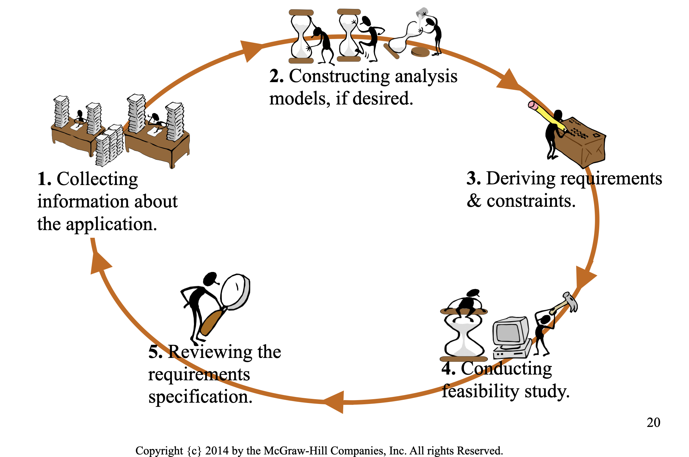

# Requirements Gathering

## Overview

- Requirements the capabilities that the system must have
- One of the hardest things to do is to decide what exactly to build i.e. requirements gathering
- *Software requirements elicitation* allows us to identify the real requirements for the system 

There's a template for how the requirements should be written for this class: 

- FRN the system X must do something for someone in order to achieve goal.

Random UML: the object will always be singular and I guess they want getter / setter

## Planning Phase

The planning phase is made up of 3 activities

- requirements elicitation
- deriving use cases
- producing an iterative development plan

**Requirements Elicitation** process to identify and formulate the capabilities
*of the system.

some activities associated with requirements elicitation:

- Identifying problems
- Constructing analysis models
- Coming up with system requirements
- Feasibility study
- Checking requirements and models for desired things such as consistency and correctness
- Specifying acceptance tests
- Formulate iterative development plan

When writing a requirement it should be as accurate as possible, as any
assumptions you can run into problems.

Some challenges with software elicitation:

- Communication barrier
- Nonfunctional requirements are understated, are not identified
- Requirements change with software life cycle

## Examples of Functional and Non-Functional Requirements

#### Functional Requirements

- The system must allow a potential customer to inquire information and availability of rental cars using various combinations of search criteria including make, model, from date, to date, price range, and class (small size, medium size, large size, and luxury cars).

As stated previously there's a templates for this class.

- The system must provide interactive as well as batch-processing means for an OIE (Office of International Education) staff to enter the exchange programs into the database.

During functional requirements it's separate from design so specifying
"database" is not good in the case of the study abroad system this would be
specified in a design step.

#### Non-Functional Requirements

- The system must be capable of handling a typical workload of 10,000 (ten thousand) inquiries at the same time.

- The system must protect the contents of the website from malicious attacks and protect the privacy of its users. (Quality Requirement)
